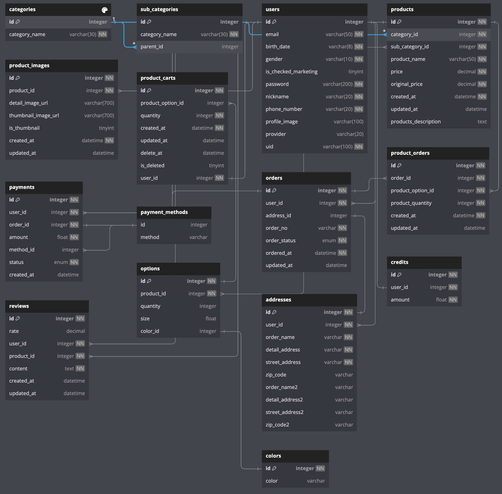

# ABC-Martens 👞

ABC-Martens 는 <a href="https://www.drmartens.co.kr/">Dr.Martens</a> 홈페이지를 분석하여 해당 사이트의 기획 의도를 이해하고 개선해보는 프로젝트입니다.

# 📝 프로젝트 정보

## 1. 제작기간

    2023.10.09 ~ 2023.10.26

## 2. 참여 인원

    Backend(4)

<table>
  <tr>
    <th>Author</th>
    <th>Author</th>
    <th>Author</th>
    <th>Author</th>
  </tr>
  <tr>
    <td>
      
    </td>
    <td>
      
    </td>
    <td>
      
    </td>
    <td>
      
    </td>
  </tr>
  <tr>
    <td>
      <a href="https://github.com/kimsw94">김승원</a>
    </td>
    <td>
      <a href="https://github.com/Park-KJ">박경재</a>
    </td>
    <td>
      <a href="https://github.com/DeveloperPMYJ">신유진</a>
    </td>
    <td>
      <a href="https://github.com/03290419">이현진</a>
    </td>
  </tr>
</table>

## 🚀 주요 기능

- [회원가입](https://github.com/wecode-bootcamp-korea/49-2nd-ABC-Martens-backend/pull/3) 👤 신유진
- [로그인](https://github.com/wecode-bootcamp-korea/49-2nd-ABC-Martens-backend/pull/8) 👤 신유진
  - [비밀번호 찾기](https://github.com/wecode-bootcamp-korea/49-2nd-ABC-Martens-backend/pull/10) 👤 이현진
- [상품 목록](https://github.com/wecode-bootcamp-korea/49-2nd-ABC-Martens-backend/pull/15) 👤 박경재
- [상품 상세](https://github.com/wecode-bootcamp-korea/49-2nd-ABC-Martens-backend/pull/7) 👤 김승원
- [장바구니](https://github.com/wecode-bootcamp-korea/49-2nd-ABC-Martens-backend/pull/11) 👤 이현진
- [주문](https://github.com/wecode-bootcamp-korea/49-2nd-ABC-Martens-backend/pull/13) 👤 이현진
- [결제](https://github.com/wecode-bootcamp-korea/49-2nd-ABC-Martens-backend/pull/16) 👤 이현진
- [외부 API 연동](https://github.com/wecode-bootcamp-korea/49-2nd-ABC-Martens-backend/pull/9) 👤 이현진
  - 카카오 로그인, 토스 페이먼츠 결제모듈 연결

## 🛠️ 사용 기술

    Express.js
    TypeORM
    JWT
    bcrypt
    nodemailer
    lodash

# 📊 ERD

## 🗄️ 기획문서

<a href="https://fern-shape-a88.notion.site/ABC-Martens-017c63872abf45489f890abbc6fa7e53?pvs=4">기획 문서 바로가기 </a>
